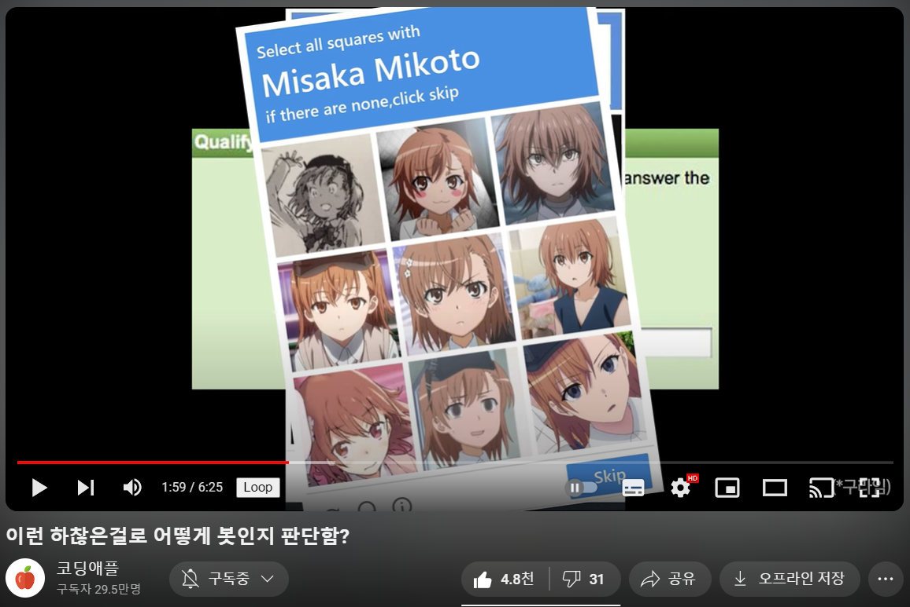
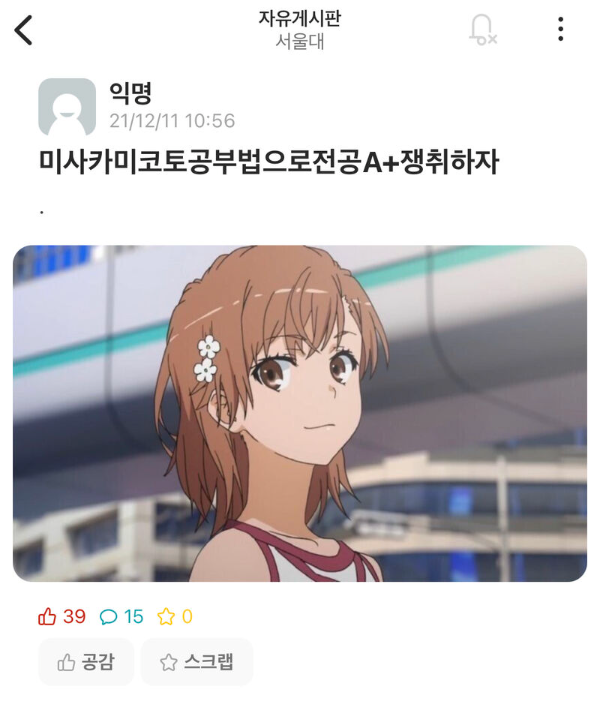
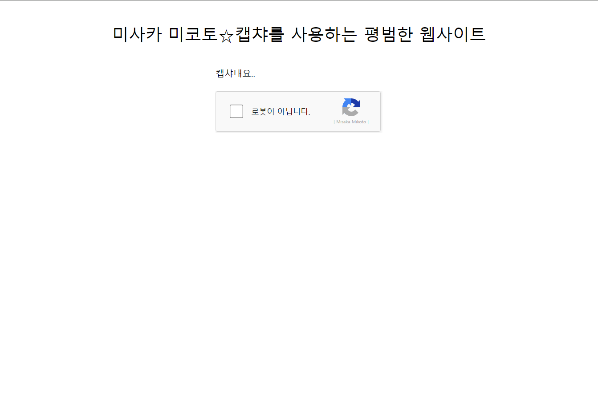

# Misaka Mikoto Captcha

미사카 미코토 리캡챠.

## 개발 동기

 - 1 ~~[link](https://m.humoruniv.com/board/read.html?&table=thema2&number=1387050)~~    

 - 2 **[코딩애플 유튜브](https://youtu.be/pFjhHPa_Apw?t=119)**   

 - 3
    - 심심함.

## 구조

 - 부득이하게도 2도메인 소유주가 아닌지라, 한 서버(localhost:3000)에서 웹 렌더링(/), 캡챠 api(/captcha) 둘다 함.
 - 구조는 따로 md파일 만들예정

> #### <code>[서버](server.js)</code>   
    - 웹 렌더링   
    - 캡챠 서버

> #### <code>[클라](static/)</code>
    - 

## TODO

> 접속했을 때 과정

 - [X] 0. (server.js)  send index.html
 - [X] 1. (index.html) script:src - ./captcha/api.js
 - [X] 2. (index.html) div id="m-captcha"
 - [X] 3. (api.js)     m-captcha.innerHTML <- ./captcha (+ ./captcha/main.js)
 - [ ] 4. (index.html) onclick -> display ./captcha/form (+ answer)
 - [ ] 5. (index.html) submit form - POST ./captcha/submit  { 'selected': number[] }
 - [ ] 6. (server.js)  check with id, good -> send { 'status': 'ok' }
 - [ ] 7. (index.html) ok -> hide form, display checkmark.   
done

> 서버

> 클라

 - [X] <code>첫 화면</code>

   
 - [X] 간단한 사이트
 - [X] 캡챠 iframe

 - [ ] 캡챠 클릭 시 
